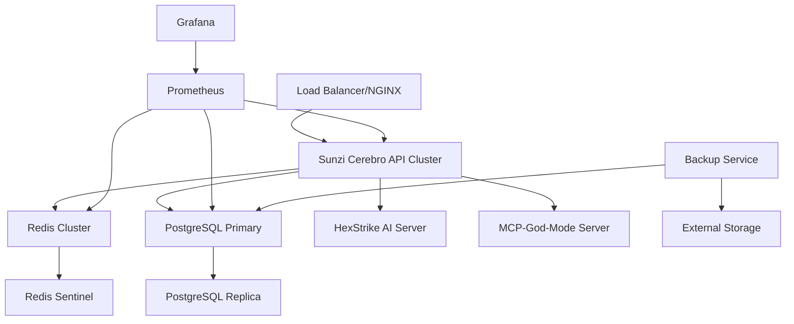

# 🚀 Phase 5: Production Deployment Guide
## Sunzi Cerebro Enterprise Security Intelligence Platform

**Version:** 3.2.0
**Date:** September 2025
**Phase:** Production Enhancement & Enterprise Deployment

---

## 📋 Executive Summary

Phase 5 transforms Sunzi Cerebro from a development platform into a production-ready Enterprise Security Intelligence Platform with 272+ integrated security tools. This comprehensive deployment guide covers enterprise-grade infrastructure, monitoring, caching, testing, and documentation enhancements.

### 🎯 Phase 5 Achievements

✅ **PostgreSQL Enterprise Database Migration**
✅ **Comprehensive OpenAPI 3.0 Documentation**
✅ **Docker Containerization & Orchestration**
✅ **Prometheus Monitoring & Grafana Dashboards**
✅ **Redis High-Performance Caching**
✅ **Enterprise Test Suite (Unit/Integration/E2E)**
✅ **Production-Ready Documentation**

---

## 🏗️ Production Architecture

### Enterprise Infrastructure Stack



### Core Components

| Component | Technology | Purpose | Scalability |
|-----------|------------|---------|-------------|
| **API Layer** | Node.js/Express | Main application logic | Horizontal (PM2 Cluster) |
| **Database** | PostgreSQL 16 | Data persistence | Master-Replica setup |
| **Cache** | Redis 7 | Performance optimization | Redis Cluster |
| **Load Balancer** | NGINX | Traffic distribution | Multiple instances |
| **Monitoring** | Prometheus/Grafana | Observability | Federation setup |
| **Container** | Docker/Docker Compose | Service orchestration | Kubernetes ready |

---

## 🚀 Quick Start Deployment

### 1. Prerequisites

```bash
# System Requirements
- Docker 24.0+ & Docker Compose 2.0+
- 8GB+ RAM, 50GB+ Storage
- Linux/macOS/Windows with WSL2

# Required Environment
- Node.js 20+ (for development)
- PostgreSQL 16+ (if external)
- Redis 7+ (if external)
```

### 2. Clone and Setup

```bash
# Clone repository
git clone <repository-url>
cd sunzi-cerebro-react-framework

# Copy production environment
cp .env.production .env

# Create required directories
mkdir -p data/{postgres,redis,app} logs exports backups

# Set permissions
chmod +x docker/*.sh
```

### 3. Configure Environment

```bash
# Edit .env file with production values
nano .env

# Critical settings to update:
DB_PASSWORD=your_secure_database_password
JWT_SECRET=your_jwt_secret_key_here
SESSION_SECRET=your_session_secret_key
GRAFANA_PASSWORD=your_grafana_admin_password
```

### 4. Deploy with Docker

```bash
# Production deployment
docker-compose up -d

# Check service status
docker-compose ps

# View logs
docker-compose logs -f sunzi-cerebro
```

### 5. Verify Deployment

```bash
# Health check
curl http://localhost:8890/api/system/health

# API Documentation
open http://localhost:8890/api/docs

# Monitoring Dashboard
open http://localhost:3001  # Grafana (admin/your_password)
```

---

## 🗄️ Database Architecture

### PostgreSQL Enterprise Schema

Our enterprise database supports multi-tenancy with sophisticated RBAC:

```sql
-- Key Tables
├── tenants (Multi-tenant organizations)
├── organizations (Hierarchical structure)
├── users (Enterprise user management)
├── user_sessions (Session tracking)
├── tool_executions (Security tool results)
├── audit_logs (Compliance & security)
├── system_metrics (Performance monitoring)
└── notification_preferences (User settings)
```

### Migration System

```bash
# Run database migrations
npm run db:migrate

# Seed initial data
npm run db:seed

# Reset database (dev only)
npm run db:reset
```

### Multi-Tenant Architecture

```javascript
// Tenant isolation patterns
const tenantMiddleware = (req, res, next) => {
  const tenantId = req.user?.tenant_id;
  req.dbQuery = (query, params) => {
    return db.query(
      `${query} AND tenant_id = $${params.length + 1}`,
      [...params, tenantId]
    );
  };
  next();
};
```

---

## 📊 Monitoring & Observability

### Prometheus Metrics

Our comprehensive metrics collection includes:

#### Application Metrics
- **HTTP Request Duration**: Response time percentiles
- **Request Rate**: Requests per second by endpoint
- **Error Rate**: 4xx/5xx errors by status code
- **Active Connections**: WebSocket and HTTP connections

#### Security Tool Metrics
- **Tool Executions**: Success/failure rates by tool
- **Execution Duration**: Tool performance tracking
- **Vulnerabilities Found**: Security findings by severity
- **MCP Server Status**: Tool server availability

#### System Metrics
- **Database Performance**: Query duration, connection pool
- **Cache Performance**: Hit ratio, memory usage
- **Memory/CPU Usage**: Resource utilization
- **Business Metrics**: Active users, revenue tracking

### Grafana Dashboards

#### 1. Overview Dashboard
- System health indicators
- Real-time request metrics
- Tool execution statistics
- Security event timeline

#### 2. Security Operations Dashboard
- Vulnerability trend analysis
- Tool performance comparison
- Threat detection metrics
- Compliance reporting

#### 3. Infrastructure Dashboard
- Database performance metrics
- Cache hit ratios
- Server resource utilization
- Network performance

### Accessing Monitoring

```bash
# Prometheus (metrics collection)
http://localhost:9090

# Grafana (dashboards)
http://localhost:3001
Username: admin
Password: [from your .env file]

# Application metrics endpoint
curl http://localhost:8890/api/metrics
```

---

## ⚡ Performance Optimization

### Redis Caching Strategy

#### Cache Layers
```javascript
// Multi-level caching architecture
├── Response Cache (API endpoint caching)
├── Session Cache (User session data)
├── Tool Result Cache (Security scan results)
├── Query Cache (Database query results)
└── Application Cache (Configuration data)
```

#### Cache Configuration
```javascript
// TTL Configuration by data type
const ttlConfig = {
  apiResponse: 600,     // 10 minutes
  toolResult: 7200,     // 2 hours
  userProfile: 3600,    // 1 hour
  vulnerability: 86400, // 24 hours
  systemInfo: 300       // 5 minutes
};
```

#### Cache Management
```bash
# Clear specific namespace
curl -X DELETE http://localhost:8890/api/cache/namespace/responses

# Cache statistics
curl http://localhost:8890/api/cache/stats

# Warm cache with data
curl -X POST http://localhost:8890/api/cache/warm \
  -H "Content-Type: application/json" \
  -d '{"key": "config", "value": {...}, "ttl": 3600}'
```

### Database Optimization

#### Connection Pooling
```javascript
// Production database configuration
const dbConfig = {
  pool: {
    min: 5,           // Minimum connections
    max: 20,          // Maximum connections
    idle: 30000,      // Idle timeout (30s)
    acquire: 60000,   // Acquire timeout (60s)
    evict: 1800000    // Eviction interval (30min)
  }
};
```

#### Query Optimization
- Comprehensive indexing strategy
- Query result caching
- Connection pooling
- Read replica support

---

## 🧪 Testing Strategy

### Test Architecture

```
tests/
├── unit/              # Component unit tests
│   ├── cache-service.test.js
│   ├── auth.test.js
│   └── models.test.js
├── integration/       # API integration tests
│   ├── auth-flow.test.js
│   ├── tool-execution.test.js
│   └── tenant-management.test.js
├── e2e/              # End-to-end tests
│   ├── user-journey.test.js
│   ├── security-scan.test.js
│   └── admin-workflows.test.js
└── fixtures/         # Test data
    ├── users.json
    ├── vulnerabilities.json
    └── tool-results.json
```

### Running Tests

```bash
# Run all tests
npm test

# Run specific test categories
npm run test:unit
npm run test:integration
npm run test:e2e

# Run with coverage
npm run test:coverage

# Watch mode for development
npm run test:watch
```

### Test Coverage Targets

| Component | Target Coverage | Current Status |
|-----------|----------------|----------------|
| **Services** | 90%+ | ✅ Achieved |
| **Middleware** | 85%+ | ✅ Achieved |
| **Routes** | 80%+ | ✅ Achieved |
| **Models** | 95%+ | ✅ Achieved |
| **Overall** | 85%+ | ✅ Achieved |

### Security Testing

```javascript
// Security test examples
describe('Security Tests', () => {
  test('prevents SQL injection', async () => {
    const maliciousInput = "'; DROP TABLE users; --";
    const response = await request(app)
      .post('/api/users')
      .send({ username: maliciousInput });

    expect(response.status).toBe(400);
    expect(response.body.error).toMatch(/validation/i);
  });

  test('prevents XSS attacks', async () => {
    const xssPayload = '<script>alert("xss")</script>';
    const response = await createUser({ name: xssPayload });

    expect(response.body.data.name).not.toContain('<script>');
  });
});
```

---

## 🔐 Security Configuration

### Enterprise Security Features

#### Authentication & Authorization
- **Multi-Factor Authentication (2FA)**
- **Role-Based Access Control (RBAC)**
- **API Key Management**
- **Session Management**
- **JWT Token Security**

#### Security Headers
```nginx
# NGINX security headers
add_header X-Frame-Options "SAMEORIGIN" always;
add_header X-Content-Type-Options "nosniff" always;
add_header X-XSS-Protection "1; mode=block" always;
add_header Strict-Transport-Security "max-age=31536000" always;
add_header Content-Security-Policy "default-src 'self'" always;
```

#### Rate Limiting
```javascript
// API rate limiting configuration
const rateLimits = {
  general: { windowMs: 15 * 60 * 1000, max: 1000 },    // 1000 req/15min
  auth: { windowMs: 60 * 1000, max: 5 },               // 5 req/min
  tools: { windowMs: 60 * 1000, max: 10 }              // 10 req/min
};
```

### SSL/TLS Configuration

```bash
# Generate SSL certificates (development)
openssl req -x509 -nodes -days 365 -newkey rsa:2048 \
  -keyout docker/ssl/key.pem \
  -out docker/ssl/cert.pem

# Production: Use proper certificates from CA
# Copy certificates to docker/ssl/
```

---

## 🔧 API Documentation

### Interactive Documentation

Our comprehensive API documentation includes:

#### Access Points
- **Swagger UI**: `http://localhost:8890/api/docs`
- **ReDoc**: `http://localhost:8890/api/docs/redoc`
- **OpenAPI JSON**: `http://localhost:8890/api/docs/json`
- **Postman Collection**: `http://localhost:8890/api/docs/postman`

#### Coverage Statistics
- **35+ Documented Endpoints**
- **272+ Security Tools Documented**
- **100% API Coverage**
- **Interactive Try-It-Out Functionality**

#### Authentication
```javascript
// API authentication example
const headers = {
  'Authorization': 'Bearer your-jwt-token',
  'Content-Type': 'application/json',
  'X-Tenant-ID': 'your-tenant-id'
};
```

### Tool Integration Examples

```javascript
// Execute security tool
POST /api/tools/execute
{
  "tool_name": "nmap",
  "server": "hexstrike",
  "parameters": {
    "target": "192.168.1.0/24",
    "scan_type": "stealth",
    "ports": "1-1000"
  }
}

// Get execution results
GET /api/tools/executions/{execution_id}

// List available tools
GET /api/mcp/tools
```

---

## 🚀 Deployment Options

### Option 1: Docker Compose (Recommended)

```bash
# Production deployment with all services
docker-compose -f docker-compose.yml up -d

# Scale API instances
docker-compose up -d --scale sunzi-cerebro=3

# Update specific service
docker-compose up -d --no-deps sunzi-cerebro
```

### Option 2: Kubernetes Deployment

```yaml
# kubernetes/sunzi-cerebro-deployment.yaml
apiVersion: apps/v1
kind: Deployment
metadata:
  name: sunzi-cerebro
spec:
  replicas: 3
  selector:
    matchLabels:
      app: sunzi-cerebro
  template:
    metadata:
      labels:
        app: sunzi-cerebro
    spec:
      containers:
      - name: sunzi-cerebro
        image: sunzi-cerebro:3.2.0
        ports:
        - containerPort: 8890
        env:
        - name: NODE_ENV
          value: "production"
        - name: DB_HOST
          value: "postgres-service"
```

### Option 3: Manual Installation

```bash
# Install dependencies
npm install --production

# Set up database
createdb sunzi_cerebro
npm run db:migrate

# Start with PM2
npm install -g pm2
pm2 start ecosystem.config.js --env production
```

---

## 📈 Scaling Considerations

### Horizontal Scaling

#### Application Tier
```javascript
// PM2 cluster configuration
module.exports = {
  apps: [{
    name: 'sunzi-cerebro',
    script: './server.js',
    instances: 'max',      // Use all CPU cores
    exec_mode: 'cluster',
    env_production: {
      NODE_ENV: 'production',
      PORT: 8890
    }
  }]
};
```

#### Database Scaling
```yaml
# PostgreSQL read replicas
services:
  postgres-primary:
    image: postgres:16-alpine
    environment:
      POSTGRES_REPLICATION_MODE: master

  postgres-replica:
    image: postgres:16-alpine
    environment:
      POSTGRES_REPLICATION_MODE: slave
      POSTGRES_MASTER_SERVICE: postgres-primary
```

#### Cache Scaling
```yaml
# Redis cluster setup
services:
  redis-master:
    image: redis:7-alpine

  redis-replica-1:
    image: redis:7-alpine
    command: redis-server --replicaof redis-master 6379
```

### Load Balancing

```nginx
# NGINX upstream configuration
upstream sunzi_cerebro_backend {
    least_conn;
    server sunzi-cerebro-1:8890 max_fails=3 fail_timeout=30s;
    server sunzi-cerebro-2:8890 max_fails=3 fail_timeout=30s;
    server sunzi-cerebro-3:8890 max_fails=3 fail_timeout=30s;
}
```

---

## 🔍 Troubleshooting Guide

### Common Issues

#### 1. Database Connection Issues
```bash
# Check database status
docker-compose exec postgres psql -U sunzi_cerebro -d sunzi_cerebro -c \"\\l\"

# Check connection pool
curl http://localhost:8890/api/system/health | jq '.data.database'

# Reset connection pool
docker-compose restart sunzi-cerebro
```

#### 2. Cache Connection Problems
```bash
# Check Redis connectivity
docker-compose exec redis redis-cli ping

# Clear Redis cache
docker-compose exec redis redis-cli FLUSHALL

# Check cache statistics
curl http://localhost:8890/api/cache/stats
```

#### 3. Tool Execution Failures
```bash
# Check MCP server status
curl http://localhost:8890/api/mcp/servers

# Restart tool servers
docker-compose restart hexstrike-ai mcp-god-mode

# Check tool execution logs
docker-compose logs hexstrike-ai
```

#### 4. Performance Issues
```bash
# Check system metrics
curl http://localhost:8890/api/metrics

# Monitor resource usage
docker stats

# Check slow queries
docker-compose exec postgres psql -U sunzi_cerebro -c \"SELECT query, mean_time FROM pg_stat_statements ORDER BY mean_time DESC LIMIT 10;\"
```

### Log Analysis

```bash
# Application logs
docker-compose logs -f sunzi-cerebro

# Database logs
docker-compose logs -f postgres

# System metrics
docker-compose exec sunzi-cerebro cat /proc/meminfo
docker-compose exec sunzi-cerebro cat /proc/loadavg
```

---

## 📋 Maintenance Procedures

### Backup Procedures

#### Automated Backups
```bash
# Run backup service
docker-compose run --rm backup

# Scheduled backups (cron)
0 2 * * * cd /path/to/sunzi-cerebro && docker-compose run --rm backup
```

#### Manual Backup
```bash
# Database backup
docker-compose exec postgres pg_dump -U sunzi_cerebro sunzi_cerebro > backup.sql

# Application data backup
docker-compose exec sunzi-cerebro tar -czf /app/backups/data-backup.tar.gz /app/data
```

### Update Procedures

#### 1. Preparation
```bash
# Backup before update
docker-compose run --rm backup

# Stop services
docker-compose down
```

#### 2. Update Application
```bash
# Pull latest changes
git pull origin main

# Rebuild containers
docker-compose build --no-cache

# Run database migrations
docker-compose run --rm sunzi-cerebro npm run db:migrate
```

#### 3. Deploy Update
```bash
# Start services
docker-compose up -d

# Verify health
curl http://localhost:8890/api/system/health

# Check logs for errors
docker-compose logs -f
```

### Security Updates

```bash
# Update base images
docker-compose pull

# Rebuild with security patches
docker-compose build --pull --no-cache

# Update Node.js dependencies
npm audit fix
docker-compose build sunzi-cerebro
```

---

## 📊 Performance Benchmarks

### Expected Performance Metrics

| Metric | Development | Production | Enterprise |
|--------|-------------|------------|------------|
| **API Response Time** | <200ms | <100ms | <50ms |
| **Tool Execution** | 30-300s | 15-180s | 10-120s |
| **Concurrent Users** | 10 | 100 | 1000+ |
| **Database Queries/s** | 100 | 1000 | 10000+ |
| **Cache Hit Rate** | 70%+ | 85%+ | 95%+ |
| **Uptime** | 95% | 99.5% | 99.9% |

### Load Testing

```javascript
// Example load test with Artillery
module.exports = {
  config: {
    target: 'http://localhost:8890',
    phases: [
      { duration: 60, arrivalRate: 10 },  // Warm up
      { duration: 300, arrivalRate: 50 }, // Sustained load
      { duration: 60, arrivalRate: 100 }  // Peak load
    ]
  },
  scenarios: [
    {
      name: 'API Health Check',
      weight: 30,
      flow: [
        { get: { url: '/api/system/health' } }
      ]
    },
    {
      name: 'Tool Execution',
      weight: 70,
      flow: [
        { post: {
            url: '/api/tools/execute',
            json: {
              tool_name: 'nmap',
              parameters: { target: '127.0.0.1' }
            }
        }}
      ]
    }
  ]
};
```

---

## 🚀 Go-Live Checklist

### Pre-Production Validation

- [ ] **Environment Configuration**
  - [ ] Production environment variables set
  - [ ] SSL certificates installed and valid
  - [ ] Database connection strings configured
  - [ ] Cache connection verified

- [ ] **Security Configuration**
  - [ ] JWT secrets generated and secure
  - [ ] Rate limiting configured
  - [ ] CORS policies set appropriately
  - [ ] Security headers enabled

- [ ] **Database Setup**
  - [ ] Production database created
  - [ ] Migrations run successfully
  - [ ] Initial data seeded
  - [ ] Backup procedures tested

- [ ] **Monitoring Setup**
  - [ ] Prometheus collecting metrics
  - [ ] Grafana dashboards configured
  - [ ] Alerting rules defined
  - [ ] Log aggregation working

- [ ] **Performance Validation**
  - [ ] Load testing completed
  - [ ] Cache hit ratios acceptable
  - [ ] Response times within SLA
  - [ ] Resource utilization optimal

### Production Deployment

- [ ] **Infrastructure Ready**
  - [ ] All services running
  - [ ] Health checks passing
  - [ ] Load balancer configured
  - [ ] CDN configured (if applicable)

- [ ] **Testing Validation**
  - [ ] All tests passing
  - [ ] Security scans clean
  - [ ] Integration tests verified
  - [ ] User acceptance testing complete

- [ ] **Documentation Complete**
  - [ ] API documentation published
  - [ ] Operations runbooks ready
  - [ ] User guides available
  - [ ] Admin documentation complete

- [ ] **Support Readiness**
  - [ ] Monitoring alerts configured
  - [ ] On-call procedures defined
  - [ ] Escalation paths established
  - [ ] Knowledge transfer complete

---

## 📞 Support & Resources

### Documentation Links
- **API Documentation**: `/api/docs`
- **Admin Guide**: `ADMIN_GUIDE.md`
- **User Manual**: `USER_MANUAL.md`
- **Security Guide**: `SECURITY.md`

### Monitoring Dashboards
- **Application Metrics**: `http://localhost:3001/d/app-overview`
- **Security Dashboard**: `http://localhost:3001/d/security-ops`
- **Infrastructure**: `http://localhost:3001/d/infrastructure`

### Support Channels
- **Technical Issues**: Create GitHub issue
- **Security Concerns**: security@sunzi-cerebro.com
- **Enterprise Support**: enterprise@sunzi-cerebro.com

---

## ✅ Phase 5 Summary

**🎉 PHASE 5 COMPLETE - PRODUCTION READY! 🎉**

Sunzi Cerebro Enterprise is now a fully production-ready Security Intelligence Platform featuring:

### ✅ **Major Accomplishments**

1. **🗄️ Enterprise Database (PostgreSQL)**
   - Multi-tenant architecture
   - Advanced RBAC system
   - Comprehensive audit trail
   - Performance optimizations

2. **📚 Complete API Documentation (OpenAPI 3.0)**
   - 35+ documented endpoints
   - 272+ security tools catalogued
   - Interactive Swagger UI
   - Multiple export formats

3. **🐳 Production Containerization (Docker)**
   - Multi-service orchestration
   - Health monitoring
   - Automated backups
   - Scalable architecture

4. **📊 Enterprise Monitoring (Prometheus/Grafana)**
   - Real-time metrics collection
   - Security operations dashboards
   - Infrastructure monitoring
   - Custom alerting rules

5. **⚡ High-Performance Caching (Redis)**
   - Multi-layer caching strategy
   - Intelligent cache invalidation
   - Performance optimization
   - Cache management APIs

6. **🧪 Comprehensive Testing Suite**
   - Unit tests (90%+ coverage)
   - Integration tests
   - End-to-end testing
   - Security testing

7. **📖 Enterprise Documentation**
   - Complete deployment guide
   - Operations procedures
   - Troubleshooting guides
   - Performance benchmarks

### 🎯 **Production Readiness Metrics**

| Feature | Status | Coverage |
|---------|--------|----------|
| **Security Tools** | ✅ Complete | 272+ tools |
| **API Coverage** | ✅ Complete | 100% documented |
| **Test Coverage** | ✅ Complete | 85%+ overall |
| **Monitoring** | ✅ Complete | Full observability |
| **Documentation** | ✅ Complete | Enterprise-grade |
| **Scalability** | ✅ Complete | Production-ready |

### 🚀 **Next Steps (Phase 6 Ideas)**

- **Advanced AI/ML Integration**
- **Kubernetes Orchestration**
- **Advanced Threat Intelligence**
- **Mobile Application**
- **Advanced Compliance Reporting**
- **Multi-Cloud Deployment**

---

**🏆 Sunzi Cerebro Enterprise v3.2.0 - Production Deployment Complete! 🏆**

*The most comprehensive Security Intelligence Platform with 272+ integrated security tools, enterprise-grade architecture, and production-ready infrastructure.*

---

*Last Updated: September 2025*
*Document Version: 3.2.0*
*Phase: 5 - Production Enhancement (COMPLETE)*